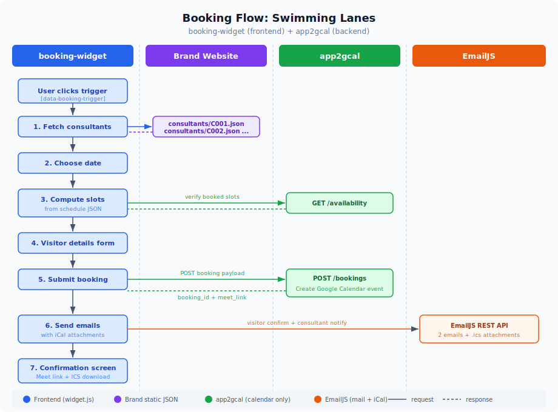

# booking-widget

Embeddable meeting booking widget. Vanilla JS, multi-brand, no dependencies.

## Architecture

Two independent services work together:

| Service | Responsibility |
|---|---|
| **booking-widget** (this repo) | Frontend popup, consultant data, availability computation, email with iCal via EmailJS |
| **app2gcal** | Calendar operations only: Google Calendar event creation, availability verification |



- booking-widget fetches consultant profiles from JSON files hosted on each brand's website
- Availability slots are computed client-side from consultant schedules, then verified against app2gcal for already-booked times
- Emails (visitor confirmation + consultant notification) with iCal attachments are sent via EmailJS directly from the widget
- app2gcal handles only the Google Calendar integration (create event, check booked slots)

## Embed

```html
<script src="https://booking.simplify-erp.de/widget.js"
        data-api="https://cal.google.wapsol.de"
        data-consultants-base="https://simplify-erp.de/data/consultants"
        data-consultants="C001,C002,C003"
        data-lang="de"
        data-brand="Simplify ERP"
        data-context-product="ERP Cloud"
        data-context-plan="Enterprise">
</script>
```

### Per-brand examples

**simplify-erp.de**
```html
<script src="https://booking.simplify-erp.de/widget.js"
        data-api="https://cal.google.wapsol.de"
        data-consultants-base="https://simplify-erp.de/data/consultants"
        data-consultants="C001,C002"
        data-lang="de"
        data-brand="Simplify ERP">
</script>
```

**re-cloud.io**
```html
<script src="https://booking.re-cloud.io/widget.js"
        data-api="https://cal.google.wapsol.de"
        data-consultants-base="https://re-cloud.io/data/consultants"
        data-consultants="C002,C003"
        data-lang="en"
        data-brand="RE Cloud">
</script>
```

**voltaic.systems**
```html
<script src="https://booking.voltaic.systems/widget.js"
        data-api="https://cal.google.wapsol.de"
        data-consultants-base="https://voltaic.systems/data/consultants"
        data-consultants="C004"
        data-lang="de"
        data-brand="Voltaic Systems">
</script>
```

**poweron.software**
```html
<script src="https://booking.poweron.software/widget.js"
        data-api="https://cal.google.wapsol.de"
        data-consultants-base="https://poweron.software/data/consultants"
        data-consultants="C004"
        data-lang="en"
        data-brand="PowerOn Software">
</script>
```

## Trigger buttons

Any element with `data-booking-trigger` opens the widget on click:

```html
<button data-booking-trigger>Termin buchen</button>

<a href="#" data-booking-trigger
   data-booking-consultant="C001"
   data-booking-topic="ERP Cloud">Talk to Anna</a>
```

Add `data-trigger="floating"` to the script tag for a fixed bottom-right CTA button.

## Consultant JSON

Each brand hosts JSON files at their `data-consultants-base` URL. Schema:

```json
{
  "id": "C001",
  "name": "Anna Becker",
  "role": "Senior ERP Consultant",
  "email": "anna.becker@simplify-erp.de",
  "phone": "+49 170 1234567",
  "photo": "https://simplify-erp.de/team/anna-becker.jpg",
  "schedule": {
    "mon": ["09:00-12:00", "14:00-17:00"],
    "tue": ["09:00-12:00", "14:00-17:00"],
    "wed": ["09:00-12:00", "14:00-17:00"],
    "thu": ["09:00-12:00", "14:00-17:00"],
    "fri": ["09:00-12:00", "14:00-16:00"]
  },
  "slotDuration": 30,
  "exceptions": {
    "2026-04-10": [],
    "2026-04-11": ["10:00-12:00"]
  }
}
```

- `schedule`: weekly recurring time ranges per day
- `exceptions`: date overrides. Empty array = fully blocked. Array of ranges = override day schedule.
- `slotDuration`: minutes per slot (default 30)

Sample files in `consultants/` folder of this repo.

## Auto theme detection

Widget auto-detects host page font, primary color, CTA color and border-radius. Override with `data-theme="none"` or set CSS variables explicitly:

```css
:root {
  --sb-primary: #0077b5;
  --sb-cta: #de182b;
  --sb-font: 'Inter', sans-serif;
  --sb-radius: 12px;
}
```

## JS API

```js
SimplifyBooking.open({
  consultant: 'C001',            // optional, pre-select consultant
  topic: 'ERP rollout',          // optional, pre-select topic
  context: { product: 'ERP' }    // optional, merged with auto-collected
})

SimplifyBooking.close()
SimplifyBooking.ready  // boolean
SimplifyBooking.on('booking:confirmed', (data) => { ... })
```

## Events

| Event | Payload | When |
|---|---|---|
| `booking:confirmed` | `{ bookingId, consultant, date, time, meetLink, visitor, context }` | Booking created |
| `booking:started` | `{ consultant?, context }` | Widget opened |
| `widget:closed` | `{}` | Widget dismissed |

## Data attributes

| Attribute | Required | Description |
|---|---|---|
| `data-api` | yes | app2gcal backend URL |
| `data-consultants-base` | yes* | Base URL for consultant JSON files on brand website |
| `data-consultants` | yes* | Comma-separated consultant IDs (e.g. `C001,C002`) |
| `data-consultants-url` | legacy | Single URL with all consultants (backward compat) |
| `data-lang` | no | `de` (default) or `en` |
| `data-brand` | no | Brand name for context |
| `data-consultant` | no | Pre-select consultant ID |
| `data-api-key` | no | API key for bookings endpoint |
| `data-theme` | no | `auto` (default) or `none` |
| `data-trigger` | no | `floating` for bottom-right CTA button |
| `data-emailjs-service` | no | EmailJS service ID |
| `data-emailjs-template` | no | EmailJS template ID (fallback for both) |
| `data-emailjs-template-visitor` | no | EmailJS template for visitor email |
| `data-emailjs-template-consultant` | no | EmailJS template for consultant email |
| `data-emailjs-key` | no | EmailJS public key |
| `data-context-*` | no | Custom context fields |

*Either `data-consultants-base` + `data-consultants` OR `data-consultants-url` is required.

## Build

```bash
npm install
npm run build    # -> dist/widget.js
npm run dev      # watch mode
```

## Deploy

K8s manifests in `k8s/`. Serves `dist/widget.js` via nginx:alpine.

Ingress configured for: `booking.simplify-erp.de`, `booking.re-cloud.io`, `booking.voltaic.systems`, `booking.poweron.software`.
